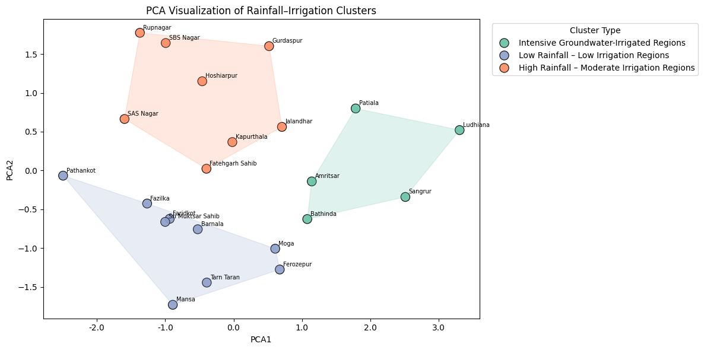
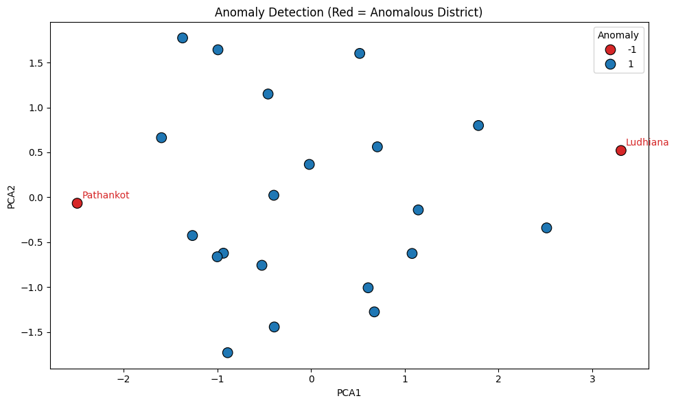

# 🌧️ Rainfall & Irrigation Pattern Analysis (Punjab)

Unsupervised machine learning on district-level rainfall, groundwater irrigation and crop data for **22 Punjab districts** – grouping districts by water-use profile and flagging districts with unusual rainfall–irrigation behaviour.

## 📌 Problem
Punjab's districts differ widely in how much they rely on rainfall versus groundwater irrigation. Instead of fixed thresholds, this project uses **K-Means clustering** to discover water-use profiles and **Isolation Forest** to detect districts that don't fit the usual pattern.

## 📂 Dataset
`dataset.csv` – 22 districts × 40 columns, no missing values:
- **Crops:** area, production and yield for paddy, wheat, maize, gram, potato, sugarcane and oilseeds
- **Groundwater:** recharge, extraction (irrigation, industrial, domestic) and stage of extraction
- **Rainfall:** mean, standard deviation, minimum and maximum

## ⚙️ Pipeline
1. **Feature engineering** – `Total_Crop_Area` (paddy + wheat + maize + gram) and `Avg_Crop_Yield`
2. **Features** – `Rainfall`, `Irrigation_Area` (annual irrigation extraction), `Total_Crop_Area`, `Avg_Crop_Yield`
3. **Scaling** – `StandardScaler` (K-Means is distance-based); fit on training districts only
4. **Choosing k** – compared k = 2–6 with Silhouette and Davies–Bouldin scores; **k = 3** chosen for interpretable profiles
5. **Clustering** – K-Means; clusters named automatically from their centroids
6. **Visualization** – PCA to 2D (≈ 80% of variance explained)
7. **Anomaly detection** – Isolation Forest (`contamination = 0.1`)

## 📊 Results

| Cluster | Profile | Districts |
|---|---|---|
| Intensive Groundwater-Irrigated | Highest irrigation extraction, largest crop area, highest yield | Amritsar, Bathinda, Ludhiana, Patiala, Sangrur |
| High Rainfall – Moderate Irrigation | Highest rainfall, moderate irrigation | Fatehgarh Sahib, Gurdaspur, Hoshiarpur, Jalandhar, Kapurthala, Rupnagar, SAS Nagar, SBS Nagar |
| Low Rainfall – Low Irrigation | Lowest rainfall, low irrigation, lower yields | Barnala, Faridkot, Fazilka, Ferozepur, Mansa, Moga, Pathankot, Sri Muktsar Sahib, Tarn Taran |

**Cluster quality (k = 3):** Silhouette ≈ 0.25, Davies–Bouldin ≈ 1.19



### Anomalies
Isolation Forest flags **Ludhiana** (by far the highest groundwater extraction) and **Pathankot** (very small crop area and very low irrigation).



## 🧠 Key Insight
The highest-output districts (Ludhiana, Patiala, Sangrur, Bathinda, Amritsar) get their yields from **heavy groundwater irrigation, not rainfall** – pointing to long-term groundwater stress in Punjab's most productive regions.

## ⚠️ Limitations
- Small dataset (22 districts) – cluster boundaries are sensitive
- Single point in time – no seasonal or year-on-year trends
- Moderate cluster separation – groups are best read as broad profiles

## 🚀 Future Scope
- Multi-year data for time-series analysis of rainfall and groundwater levels
- Compare with DBSCAN and Gaussian Mixture Models
- District-level dashboard (Power BI / Streamlit)

## 🛠️ Tech Stack
Python · Pandas · NumPy · Scikit-learn (K-Means, Isolation Forest, PCA, StandardScaler) · Matplotlib · Seaborn · SciPy

## ▶️ How to Run
```bash
pip install -r requirements.txt
jupyter notebook rainfall_irrigation_analysis.ipynb
```

## 📁 Files
```
├── rainfall_irrigation_analysis.ipynb   # full analysis with outputs
├── dataset.csv                          # district-level data
├── requirements.txt
└── images/                              # plots used in this README
```
